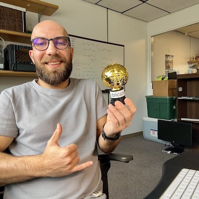

# About Me

I am an enthusiastic researcher with a great interest in environmental DNA (eDNA) and its quantification using Bayesian models. My passion for mathematics began in his teenage years when, suddenly, "it clicked, and I understood how math works." Today, I try to use math to solve ecological problems. I am very social and outgoing, always curious about the world around me. Cephalopods are my favorite animals, and I hosts a [podcast] just for the sake of learning more about these creatures. I am always up for any water sport, including surfing, diving, and snowboarding (after all, snow is water too).

[podcast]: https://open.spotify.com/show/6UqYSsFYwihwMBoysSWRjN