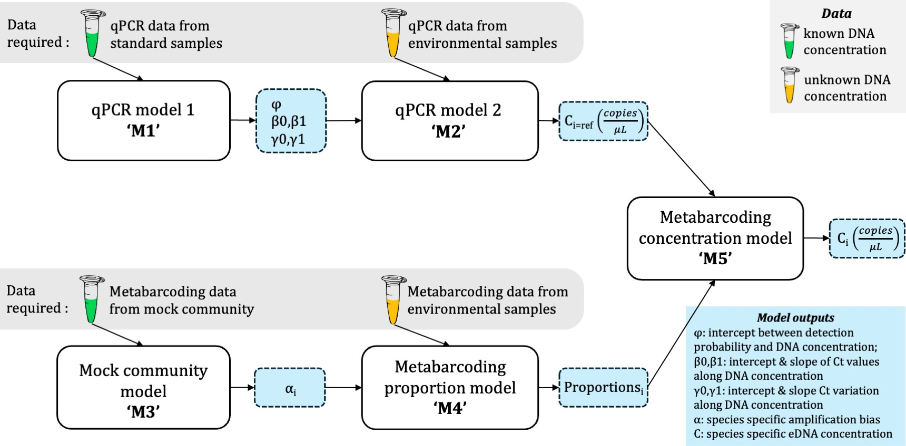

# R packages

<b style="font-size: 1.5em; line-height: 1.2;">Quantitative Metabarcoding</b> 

<link rel="stylesheet" href="{{ '/assets/css/contact-button.css' | relative_url }}">

  <a href="https://html-preview.github.io/?url=https://github.com/gledguri/QM/blob/main/html/Showcase.html" class="email-button">QM R package</a>

 

  

<b style="font-size: 1.5em; line-height: 1.2;">Quantitative Metabarcoding</b> 
<link rel="stylesheet" href="{{ '/assets/css/contact-button.css' | relative_url }}">

      <a href="https://html-preview.github.io/?url=https://github.com/gledguri/QM/blob/main/html/Showcase.html" class="email-button">QM R package</a>
    

  

  <!-- Image Container -->
  

  

1. **Title of Article 1**  
   Authors: [Your Name], Co-authors  
   Journal: [Journal Name], Year, [DOI link or URL]  
   [Link to full page about this article]

2. **Title of Article 2**  
   Authors: [Your Name], Co-authors  
   Journal: [Journal Name], Year, [DOI link or URL]  
   [Link to full page about this article]