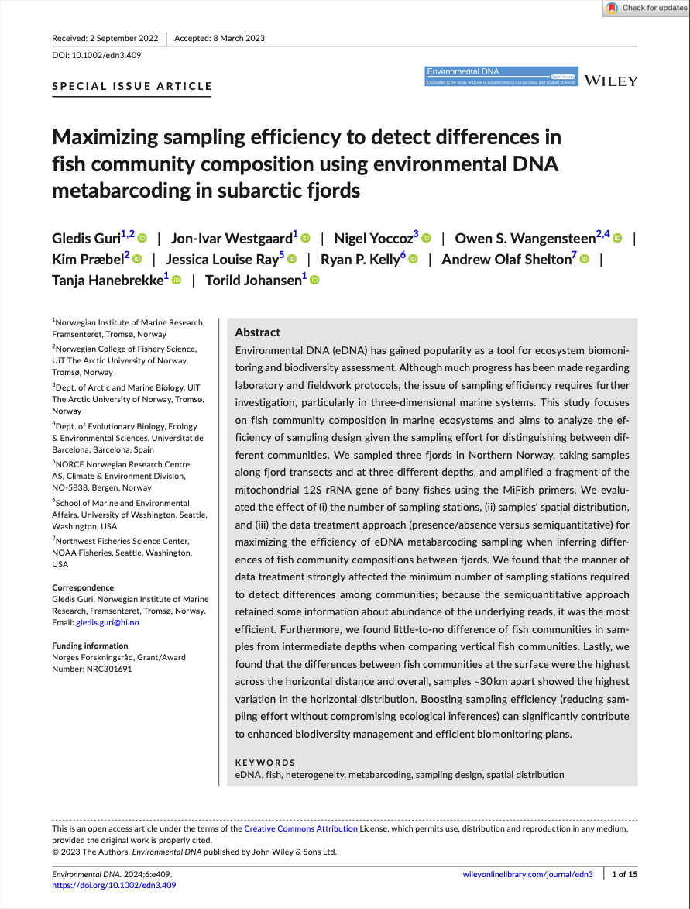
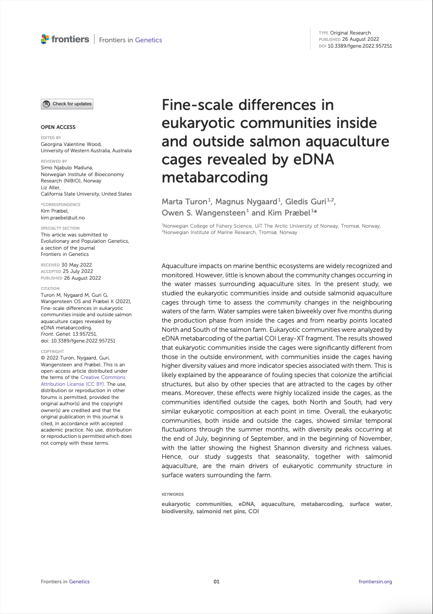

# Publications

1. **Maximizing sampling efficiency to detect differences in fish community composition using environmental DNA metabarcoding in subarctic fjords**  
   Gledis Guri1,2, Jon-Ivar Westgaard1, Nigel Yoccoz3, Owen S. Wangensteen2,4, Kim Præbel2, Jessica Louise Ray5, Ryan P. Kelly6, Andrew Olaf Shelton7, Tanja Hanebrekke1, Torild Johansen1  
   *Environmental DNA*, 2024, [doi.org/10.1002/edn3.409](https://onlinelibrary.wiley.com/doi/full/10.1002/edn3.409)
   

   

   1 Norwegian Institute of Marine Research, Framsenteret, Tromsø, Norway 
   2 Norwegian College of Fishery Science, UiT The Arctic University of Norway, Tromsø, Norway 
   3 Dept. of Arctic and Marine Biology, UiT The Arctic University of Norway, Tromsø, Norway 
   4 Dept. of Evolutionary Biology, Ecology & Environmental Sciences, Universitat de Barcelona, Barcelona, Spain 
   5 NORCE Norwegian Research Centre AS, Climate & Environment Division, NO-5838, Bergen, Norway 
   6 School of Marine and Environmental Affairs, University of Washington, Seattle, Washington, USA 
   7 Northwest Fisheries Science Center, NOAA Fisheries, Seattle, Washington, USA
   

2. **Fine-scale differences in eukaryotic communities inside and outside salmon aquaculture cages revealed by eDNA metabarcoding**  
   Marta Turon1, Magnus Nygaard1, Gledis Guri1,2, Owen S. Wangensteen1, Kim Præbel1  
   *Frontiers in Genetics*, 2022, [doi.org/10.3389/fgene.2022.957251](https://www.frontiersin.org/journals/genetics/articles/10.3389/fgene.2022.957251/full)
   
   

   1 Norwegian College of Fishery Science, UiT The Arctic University of Norway, Tromsø, Norway 
   2 Norwegian Institute of Marine Research, Tromsø, Norway
   
