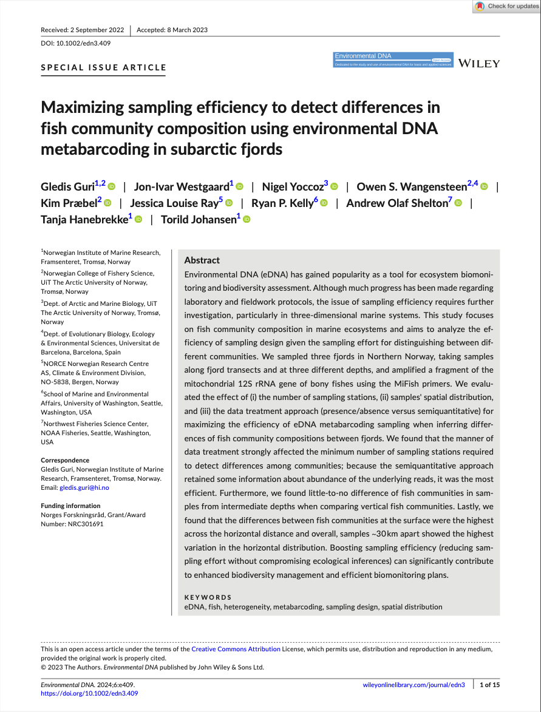

# Publications

<b style="font-size: 1.5em; line-height: 1.3;">Maximizing sampling efficiency to detect differences in fish community composition using environmental DNA metabarcoding in subarctic fjords</b> 
   Gledis Guri, Jon-Ivar Westgaard, Nigel Yoccoz, Owen S. Wangensteen, Kim Præbel, Jessica Louise Ray, Ryan P. Kelly, Andrew Olaf Shelton, Tanja Hanebrekke, Torild Johansen 
   <i>Environmental DNA</i>, 2024, <a href="https://onlinelibrary.wiley.com/doi/full/10.1002/edn3.409" target="_blank">doi.org/10.1002/edn3.409</a>

 

<b style="font-size: 1.5em; line-height: 1.3;">Fine-scale differences in eukaryotic communities inside and outside salmon aquaculture cages revealed by eDNA metabarcoding</b> 
   Marta Turon, Magnus Nygaard, Gledis Guri, Owen S. Wangensteen, Kim Præbel 
   <i>Frontiers in Genetics</i>, 2022, <a href="https://www.frontiersin.org/journals/genetics/articles/10.3389/fgene.2022.957251/full" target="_blank">doi.org/10.3389/fgene.2022.957251</a>

